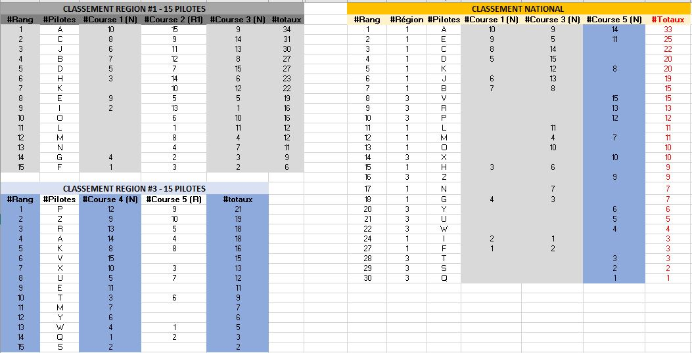

<!-- TOC -->

- [1. Objectif](#1-objectif)
- [2. formats de courses](#2-formats-de-courses)
  - [2.1. Propositions](#21-propositions)
  - [2.2. Format des courses nationales](#22-format-des-courses-nationales)
  - [2.3. Format des courses régionales](#23-format-des-courses-régionales)
- [3. Attribution des points pour les différents classements](#3-attribution-des-points-pour-les-différents-classements)
  - [3.1. Courses FFAM](#31-courses-ffam)
  - [3.2. Courses FAI](#32-courses-fai)
- [4. Mode de sélection au Championnat de France](#4-mode-de-sélection-au-championnat-de-france)
- [5. Saison de référence](#5-saison-de-référence)
- [6. Critères pour organiser le Championnat de France](#6-critères-pour-organiser-le-championnat-de-france)

<!-- /TOC -->

DRONE RACING SAISON 2020
=

# 1. Objectif

Dans toute discipline sportive une segmentation par niveau se crée naturellement. Dans le drone racing elle pourrait se segmenter ainsi : "top pilote", intermédiaire et débutants.

A ce jours seul les top pilotes et une partie des pilotes intermediaire sont representés au travers du championnat Francais. Qu'en est-il des autres pilotes intermédiaire et débutants ?

Nous sommes tous d'accord pour dire que l'idéal serait la création d'un championnat par catégorie. Malheureusement à ce jours le nombre de pratiquants (~150 pour la saison 2019) et d'événements organisés (19 pour la saison 2019) ne permet pas la mise en place de tel championnat.

Partant de ce postulat l'objectif de la LDS (Ligue de Drone Sport) est d'augmenter le nombre de pratiquant. Pour atteindre cela, nous allons mettre en place de nombreuses actions pour l'ensemble de la saison 2020.

- [x] Transparence sur les travaux accomplis par la LDS ([depot github de la LDS](https://github.com/ligue-drone-sport))
- [x] Création dun site pour la LDS (www.liguedronesport.fr)
- [x] Mise en place de courses nationale plus encadrées
- [x] Mise en place d'un championnat regional plus accessible et ouvert
- [x] Refonte du système de point pour le mode de sélection du CdF et du mode de sélection en lui meme
- [x] Critère plus stricte pour le choix de l'organisateur du Championnat de France
- [x] Refonte du mode de sélection de l'équipe de France

Vous l'aurez compris ces changements sont ambitieux et ils ne seront possible qu'avec votre participation.

Comme on dit : `L'union fait la force !`

# 2. Formats des courses

- National 
- Régional 

## 2.1. Propositions

**Autoriser les licences loisirs à participer au championnat regional.**

Course | Licence loisir | Licence compétition
------------ | ------------ | -------------
Regionale | ✔️ | ✔️
Nationale |  | ✔️
Championnat de France |   | ✔️

> Objectif : Favoriser l'accessibilité aux courses régionales pour les pilotes intermédiaire et débutant.

## 2.2. Format des courses nationales

- 16 participants minimum (Pour info la moyenne des participants sur la saison 2019 est de 25 pilotes sur 18 courses)
- Réglement FAI (toute modification concernant ce reglement ce fera en dehors de ce depot et suivra sa propre procedure)
- Déclaration des courses sur portail FFAM 30 jours avant le début de l'évènement
- Mutlirotor avec une taille d'hélice supérieur ou égale à 3 pouces

**Les courses nationales comptent pour le classement national et régional (déterminé par la région de l'évenement).**

> Objectif : Harmoniser l'organisation au maximum. Favoriser la compétition. Les courses devront être clairement identifiées comme comptant pour le classement national.

## 2.3. Format des courses régionales

- [Règlement à point](reglement-a-point.md) (montée/descente) pour favoriser les vols.

**Les courses régionales comptent uniquement pour le classement régional (déterminé par la région de l'évenement).**

> Objectif : Faciliter l'accès aux pilotes "débutants" et/ou qui ne souhaitent pas se déplacer sur de longue distance. Favoriser la découverte de la compétition dans un cadre plus agréable.

### 2.3.1. Définition des régions

Le découpage des indicatifs téléphonique peut être une bonne base de départ, soit un découpage en 5 régions.

# 3. Attribution des points pour les différents classements

## 3.1. Courses FFAM

Toutes les courses sont au minimum des courses régionales, mais celles qui respectent le cahier des charges "national" deviennent éligibles pour compter au classement national.

- Toutes les courses regionales comptent uniquement dans le classement regionale de leur region.
- Toutes les courses nationales comptent pour le classement national, et egalement dans le classement de leur region.

La zone d'attribution des points au classement regional est établi par la zone géographique de l'évènement. Exemple : Si vous participez à une course organisée à Rennes par un club Parisien, vos points seront attribués à la region Bretagne (02).

**Proposition sur l'attribution des points : en cours**

**Attention : Les pilotes non qualifiés doivent également être présent dans le classement, en les classant par leur résultat en qualification.**

> Le classement de chaque course devra être communiqué à la fédération en remplissant le fichier suivant : [template-classement.csv](fichiers/template-classement.csv).

## 3.2. Courses FAI

*Faire des propositions, sinon on reste sur le même principe de points que les courses FFAM.*

# 4. Mode de sélection au Championnat de France

- 40 premiers pilotes du classement National
- 5 premiers pilotes de chaque classement Regional, qui ne sont pas déjà éligible via le classement National

Soit un total de 65 pilotes éligibles au Championnat de France.

Plus de limite haute ou basse aux nombres de participations, toutes les participations comptent dans les differents classement.

Les classements ce font aux nombres de points, puis aux nombres de participations, puis par ordre alphabetique du nom de famille.

_Exemple de tableau regional/national ([télécharger le fichier excel](fichiers/exemple_classement_regional_national.xlsx))_

> Proposition de Bonus : A chaque nouvelle region, le pilote prend +5 pts de bonus par région, au classement national -> favoriser le déplacement inter-région

# 5. Saison de référence

Du lendemain du dernier week-end de juillet année N, au dernier week-end, inclus de juillet année N+1.

Exemple : Pour la saison 2020, du lundi 29 juillet 2019, au dimanche 26 juillet 2020.

# 6. Critères pour organiser le Championnat de France

- Etre un club affilié depuis la saison précédente au minimum.
- Avoir organisé au moins 3 courses officielles (nationale et/ou régionale)
- Application du Réglement FAI
- 32 participants minimum
- 65 participants maximum (cf. [mode de selection au CdF](#mode-de-selection-au-championnat-de-france))  
- Facilité d'accès en transport
- Proche hôtellerie et restauration
- Ouvert au public
- Organiser entre septembre et octobre
- Ouverture des inscriptions au plus tard mi-aout
- Une communication active (par exemple : 1 post par mois, 6 mois avant l'evenement pour informer les pilotes de l'evolution)
