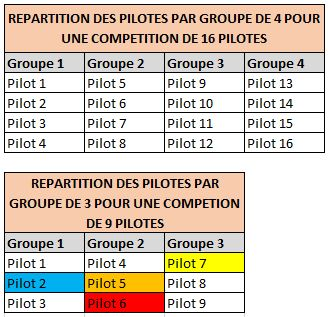
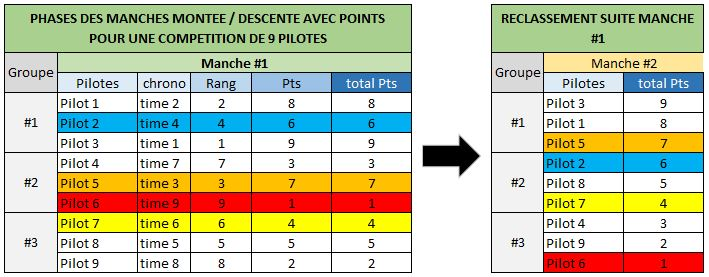
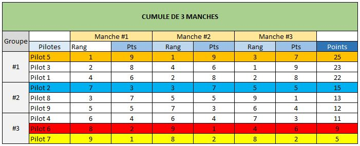

# Réglement à point

<!-- TOC -->

- [Réglement à point](#réglement-à-point)
  - [Présention](#présention)
  - [Nombre de participant](#nombre-de-participant)
  - [Qualification](#qualification)
  - [Compétition : Les manches](#compétition--les-manches)
  - [Classement final](#classement-final)
  - [Exemple de tableau](#exemple-de-tableau)

<!-- /TOC -->

## Présention

Le réglement à point à pour objectif de favoriser le nombre de vol, en permettant à tous les participants d'effectuer le même nombre de vols. Pour garder l'aspect compétition un systeme de point permet de monter/descendre dans le classement, et de toujours concourrir contre des pilotes ayant le même niveau de pilotage.

## Nombre de participants

Aucune limite minimum et/ou maximum de participants n'est défini. C'est au choix de l'organisateur.

## Attributions des Points 

N = nombre de participants / P = nombre de points (P=N)

Position | 1 | 2 | 3 | 4 | 5 | 6 | - | N
-- | -- | -- | -- | -- | -- | -- | -- | --
Point | P | P-1 | P-2 | P-3 | P-4 | P-5 | - | 1

>Exemple d'une course avec 8 pilotes

Position | 1 | 2 | 3 | 4 | 5 | 6 | 7 | 8
-- | -- | -- | -- | -- | -- | -- | -- | --
Point | 8 | 7 | 6 | 5 | 4 | 3 | 2 | 1

## Qualification et 1er classement

1 seule manche qualificative, avec 4 pilotes maximum par poules. 

A l'issue de cette manche un classement est établi en fonction des chronos de chacun. Les N premiers se retrouvent dans la poule 1, les N suivants dans la 2, etc...

Le classement peut s'établir au meilleur temps, au 2 meilleurs temps ou au 3 meilleurs temps au tour. C'est au choix de l'organisateur.

Tableau du classement après la manche qualificative

Répartition des pilotes suite à la manche qualificative 
> 2 Exemples avec 3 et 4 pilotes par groupe

## Compétition : Les manches

La compétition est composée de plusieurs manches. A définir au préalable avant la compétition.

> Attention : Toute manche commencée doit être finie.

Une manche se décompose en X groupe de 4 pilotes maximum. Exemple : 16 pilotes soit 4 groupes de 4 pilotes.

#### Exemple pour une course à 9 pilotes / 3 pilotes par poule :

La première manche est défini en fonction du classement de qualification.

Les manches suivantes se feront en fonction des points de chaque pilote.

A l'issue de chaque manche les pilotes seront classés en fonction de leur chrono, tous groupes confondus.

Un nombre de points leur sera alors attribué en fonction du nombre de pilote et de leur position dans le classement de cette manche. En cas d'égalité les pilotes seront départagés par leur classement en début de manche.

Ces points viennent s'additionner aux nombres de points accumulés sur les manches précédentes, et permettent une ré-attribution des pilotes dans chaque groupe en fonction de leur total de points accumulés.

## Classement final

Le classement final est établi sur le total de ces points, du plus grand nombre de points au plus petit.

